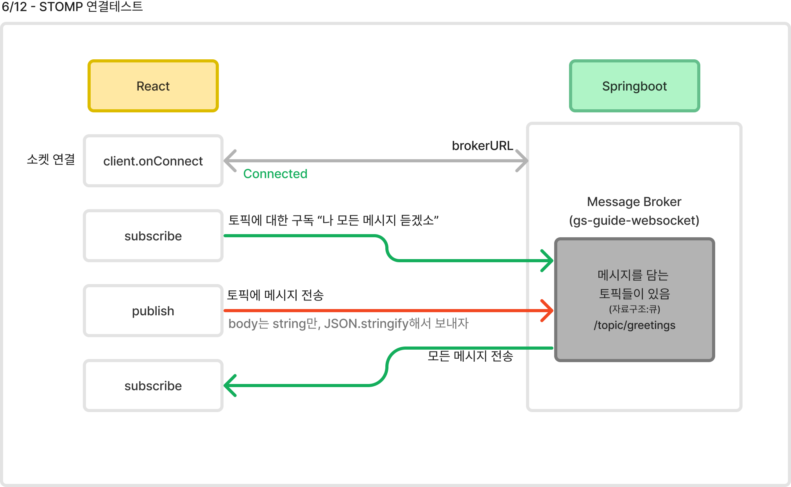

# 웹소켓을 활용한 채팅 앱
## 1. 프로젝트 개요
- 진행날짜
- 기술스텍
- 화면설계서
- 기능정의 

## 2. 웹소켓 개념

**웹소켓(Websockete)**은 웹 애플리케이션에서 서버와 클라이언트 간 양방향 통신을 가능하게 하는 프로토콜이다. 매 통신마다 3-way handshake하는 HTTP와 다르게 연결을 유지하며 낮은 지연 시간으로 통신을 주고 받는다. 

### <웹소켓의 필요성>
채팅을 한다면 상대방의 메시지를 서버에서 받아야 한다. 하지만 HTTP 방식에서는 클라이언트의 요청 없이는 서버의 메시지를 받지 못한다. 이를 HTTP에서 폴링방식 (일정 주기로 클라이언트에서 서버로 요청을 보냄) 해결할 수 있긴하다. 그러나 폴링은 클라이언트에서 지속적으로 불필요한 요청을 보내야 하기 때문에 트래픽 낭비가 심하다. 

따라서 양방향 통신을 위한 웹소켓을 사용한다. 비유로는 HTTP 통신은 전화부스에서 통화를, 웹소켓은 스마트폰을 통한 자유로운 통화라고 볼 수 있다.

### <웹소켓 주요 개념>
| **개념**           | **설명**                                                                                  |
|-------------------|-----------------------------------------------------------------------------------------|
| 실시간 통신          | 서버와 클라이언트 간의 지속적인 연결을 통해 실시간으로 데이터가 교환된다.                                                      |
| 양방향 통신          | 클라이언트와 서버 모두 데이터를 주고받을 수 있으며, 단방향 통신 프로토콜과 차별화된다.                                            |
| 연결 유지            | HTTP 요청을 반복적으로 생성할 필요 없이 지속적인 연결을 유지하여 네트워크 트래픽과 지연 시간을 감소시킨다.                          |
| 브라우저 지원        | 대부분의 최신 웹 브라우저에서 기본적으로 웹소켓을 지원하여 웹 애플리케이션에서 쉽게 구현할 수 있다.                                 |
| 프로토콜             | ws:// 또는 wss:// URL을 사용하여 웹소켓을 나타내며, wss는 SSL/TLS 암호화를 통해 보안 웹소켓을 제공한다.                          |
| 핸드셰이크           | HTTP 요청을 통해 초기화되며, 서버와 클라이언트 간의 핸드셰이크 과정을 거쳐 연결이 성립된 후 웹소켓 프로토콜로 전환된다.           |

## 3. STOMP란?
> STOMP(Simple Text Oriented Messaging Protocol)는 WebSocket 위에서 메시지 처리를 더 쉽게 해주는 프로토콜이다. STOMP를 사용하면 메시지 브로커를 통해 메시지를 주고받을 수 있다.

STOMP는 메시지 브로커를 통해 메시지를 관리하기 때문에, 메시지의 발신과 수신이 더 체계적이며 텍스트 기반의 표준화된 프로토콜로 다양한 언어와 플랫폼에서 쉽게 구현할 수 있어 사용하였다.

### <특징>
- **발신자와 수신자 구조**: 발신자가 메시지를 pub하면, 수신자가 sub하는 형태로 메시지가 전달된다.
- **메시지 큐**: 클라이언트는 특정 토픽과 구독 ID를 통해 메시지 큐의 메시지를 공유받을 수 있다.
- **메시지 브로커**: Spring 서버는 메시지 브로커 역할을 하며, 토픽을 구독한 클라이언트에게 메시지를 받거나 전달한다.
- **외부 브로커 지원**: RabbitMQ, ActiveMQ와 같은 외부 메시지 브로커를 사용하여 메시지 전달을 관리할 수 있다.

공식문서 예제를 보고 간단히 구현해보았다.
