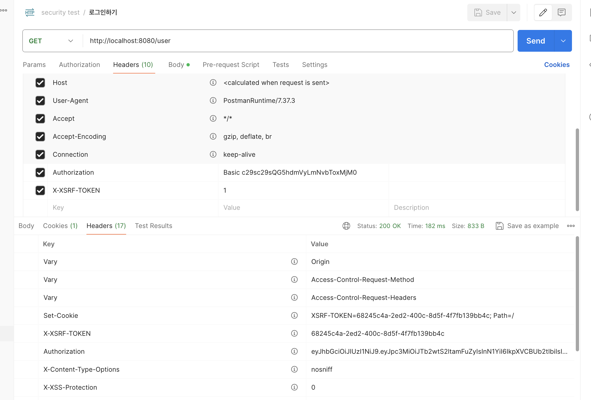
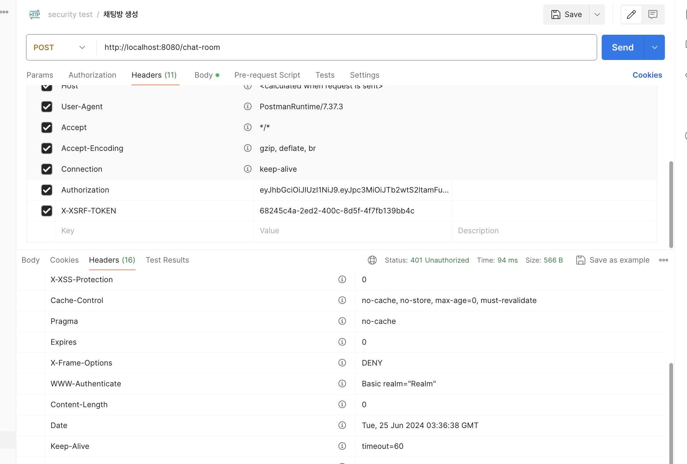

## 트러블 슈팅
- **작성자** : 오찬솔
- **작업 주제** : CSRF, HTTP method

### CSRF로 인해 POST 요청이 불가한 상황
- 정상적으로 수행되는 Get 요청

- csrf 설정으로 인해 POST 요청이 되지 않는 상황

`Get` 요청은 정상적으로 수행되나, `POST` 요청이 수행되지 않는다.


CSRF 설정을 security에서 아래처럼 아무런 방어를 하지 않도록 설정했다.


```java
 http.sessionManagement(session -> session.sessionCreationPolicy(SessionCreationPolicy.STATELESS))
                .cors(cors -> {
                    cors.configurationSource(request -> {
                        CorsConfiguration config = new CorsConfiguration();
                        config.setAllowedOrigins(Arrays.asList("http://localhost:3000","http://localhost:5173", "http://localhost:5174","http://localhost:8080"));
                        config.setAllowedMethods(Collections.singletonList("*"));
                        // 비밀번호 같은 자격증명을 헤더에 담아서 보낼 수 있도록 설정
                        config.setAllowCredentials(true);
                        config.setAllowedHeaders(Collections.singletonList("*"));
                        // Authorization 헤더를 노출하는 것을 허용, 여기에 JWT 토큰 값을 보낼 것
                        config.setExposedHeaders(Arrays.asList("Authorization"));
                        config.setMaxAge(3600L);
                        return config;
                    });
                })
                .csrf((csrf) -> csrf.disable())
                .addFilterAfter(new CsrfCookieFilter(), BasicAuthenticationFilter.class)
```

**원인**

`/chat-room` API의 목적은 채팅방을 생성하고 관련 사용자들에게 생성됨을 알리는 것이다. 하지만, `DeferredResult`를 이용한 비동기 응답을 적용해서 
비동기로 생성된 `Post` 응답에 대해 `Securing POST /chat-room` 인증 확읺을 진행하게되고 당연히 인증 정보가 없으므로 에러가 발생했었다.

**결과**
비동기 처리를 하지 않고, 한 세션 내에서 모든 응답을 하도록 API를 수정했다.
추후 `/notification/` 같이 서버에서 비동기로 클라이언트에게 전달하는 부분은 security를 다르게 생각해야할 것이다.

```java
@PostMapping("/chat-room")
@SendTo("/notification/room/{user-id}") // /notification/room/chat 을 구독하면 SendMessageDto를 받음
public ResponseEntity<String> createChatRoom(@RequestBody CreateChatRoomDto dto){
  try{
      Long roomId = chatRoomService.createChatRoomAndFirstChat(dto);
      DeferredResult<ResponseEntity<String>> deferredResult = new DeferredResult<>();
      chatRoomStompService.inviteParticipates(dto,roomId);
      return ResponseEntity.ok("Chat room created and notifications sent");
  }
  catch(RuntimeException e){
      log.error(e.getMessage());
      return ResponseEntity.status(HttpStatus.INTERNAL_SERVER_ERROR).body("서버 에러 발생!");
  }
}

```

### Invalid CSRF token found for

`/chat-room` post 요청에 대해 해결했으니 다시 CSRF 방어막을 적용해서 실행했더니 아래 같이 에러가 발생했다.

```sh
o.s.security.web.FilterChainProxy        : Securing POST /chat-room
o.s.security.web.csrf.CsrfFilter         : Invalid CSRF token found for http://localhost:8080/chat-room
o.s.security.web.FilterChainProxy        : Securing POST /error
```

분명 API 요청을 보낼 때, `X-XSRF-TOKEN`에 값을 넣어서 보냈는데 없다는 말도 안하고 그냥 유효하지 않다고만 떠서 난감한 상황이다.
원인을 찾기 위해 `CsrfFilter` 앞에 csrf 토큰 확인을 위한 커스텀 필터를 작성해서 로그를 찍워 봤다.


