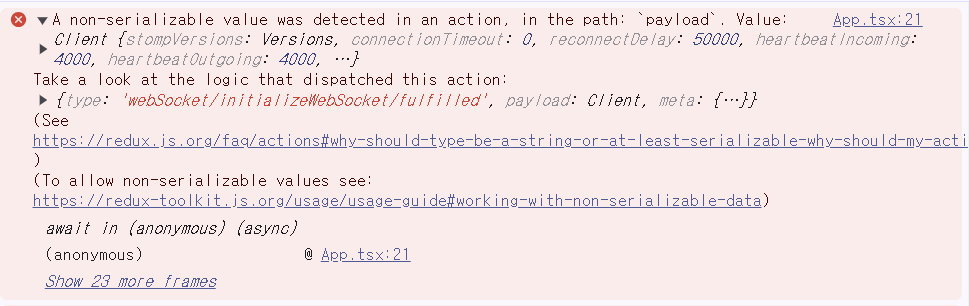

## 📌A non-serializable value was detected in an action, in the path: `payload` . Value: Client {stomp:varius~~~}




해당 에러는 리덕스 툴킷을 사용하던 중 발생한 에러로, STOMP.js로 생성한 `Client`가 직렬화가 가능하지 않은 값이라 리덕스 원칙에 맞지않아난 에러이다.

`Serializable value` 즉 직렬화 가능한 값은 데이터나 객체를 메모리 외부로 저장하거나 전송할 수 있는 형식을 의미한다. 이 데이터는 일련의 바이트로 변환해 파일, 데이터 베이스, 네트워크로 쉽게 저장 전송할 수 있다. 그 대표적인 예가 JSON이다.


에러가 났던 대목의 코드이다. 

```typescript
export const initializeWebSocket = createAsyncThunk(
  'webSocket/initializeWebSocket',
  async (_, { dispatch }) => {
    const client = new Client({
      brokerURL: `${import.meta.env.VITE_BROKER_URL}/gs-guide-websocket`,
      debug: (str) => {
        console.log('bug', str);
      },
      reconnectDelay: 50000,
      heartbeatIncoming: 4000,
      heartbeatOutgoing: 4000,
    });

    client.onConnect = () => {
      dispatch(setConnected(true));
      console.log('WebSocket connected');
      // Subscribe to any topics here
      client.subscribe('/notification/room/1', (message) => {
        console.log('Chat room created:', message.body);
      });
    };

    client.onDisconnect = () => {
      dispatch(setConnected(false));
      console.log('WebSocket disconnected');
    };

    client.activate();
    dispatch(setClient(client));

    return client;
  }
);
```

client 데이터가 왜 직렬화가 불가한 값인진 모르겠으나, 일단 리덕스 사용을 위해서는 이를 가능하도록 만들어야 한다. 

해결에 참고한 문서:
https://redux-toolkit.js.org/usage/usage-guide#working-with-non-serializable-data 

위 공식문서에 따르면 비직렬화 가능한 데이터를 수용 해야 하는 경우가 매우 드물지만
미들웨어를 사용해 특정 액션 유형이나 액션 및 상태의 필드를 무시하도록 구성할 수 있다. 따라서 저 Client가 payload로 사용되는 액션들이 직렬화 여부를 무시하도록 미들웨어를 설정해주었다.

```javascript
import { configureStore } from '@reduxjs/toolkit';
import webSocketReducer from '@/redux/webSocketSlice';
import usersReducer from '@/redux/userSlice';

const store = configureStore({
  reducer: { webSocket: webSocketReducer, user: usersReducer },
  middleware: (getDefaultMiddleware) =>
    getDefaultMiddleware({
      serializableCheck: {
        ignoredActions: ['webSocket/setClient', 'webSocket/setConnected', 'webSocket/initializeWebSocket/fulfilled'], //Client가 쓰이는 액션들의 경고 무시하기
        ignoredPaths: ['webSocket.client'],
      },
    }),
});
export type RootState = ReturnType<typeof store.getState>;
export type AppDispatch = typeof store.dispatch;
export default store;

```


## 📌A non-serializable value was detected in an action, in the path: `payload` . Value: Client {stomp:varius~~~}
